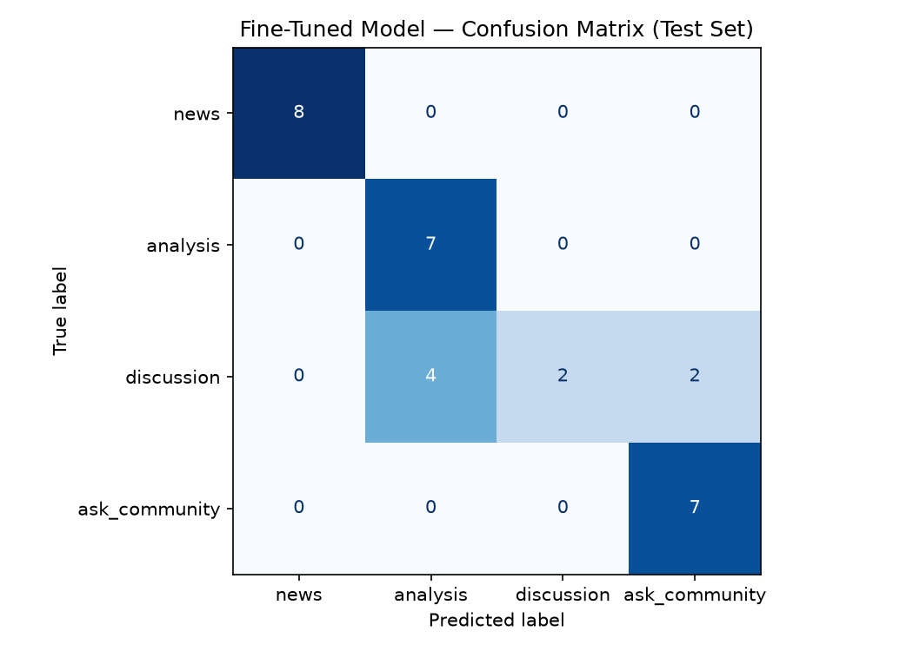

# AI201 Project 3 - TakeMeter (Hacker News)

## Project Summary
This project fine-tunes DistilBERT to classify Hacker News posts into four discourse categories:
- `news`
- `analysis`
- `discussion`
- `ask_community`

Dataset size: 200 labeled examples (balanced: 50 per class).

## Community + Label Setup
Community: Hacker News

Label definitions:
- `news`: announcement/release/event/research sharing
- `analysis`: interpretation, critique, technical breakdown
- `discussion`: opinion/debate prompt
- `ask_community`: explicit request for advice/opinions from community

## Data and Split
Input file: `hacker_news_labeled_dataset.csv`

Split strategy:
- Train: 70% (140)
- Validation: 15% (30)
- Test: 15% (30)
- Stratified by label

## Model and Training Configuration
Base model: `distilbert-base-uncased`

Training config used:
- Epochs: 3
- Learning rate: 2e-5
- Train batch size: 16
- Eval batch size: 32
- Weight decay: 0.01
- Warmup steps: 50
- Evaluation strategy: every epoch
- Best model selected by validation accuracy

Checkpoint saved in:
- `takemeter-model/checkpoint-27`

## Fine-Tuned Model Results (Test Set)
Overall accuracy: **0.800**

Per-class metrics:
- `news`: precision 1.00, recall 1.00, f1 1.00, support 8
- `analysis`: precision 0.64, recall 1.00, f1 0.78, support 7
- `discussion`: precision 1.00, recall 0.25, f1 0.40, support 8
- `ask_community`: precision 0.78, recall 1.00, f1 0.88, support 7

Macro avg F1: 0.76
Weighted avg F1: 0.76

## Confusion Matrix
Saved file: `confusion_matrix.png`

Raw matrix (rows = true, cols = predicted in label order `[news, analysis, discussion, ask_community]`):

```
[[8, 0, 0, 0],
 [0, 7, 0, 0],
 [0, 4, 2, 2],
 [0, 0, 0, 7]]
```



## Error Analysis (Wrong Predictions)
Wrong predictions: 6 / 30

Examples:
1. Text: "Are newsletters replacing technical blogs?"
   - True: `discussion`
   - Predicted: `ask_community` (0.27)

2. Text: "PostGIS pull requests are just a bunch of AI bots"
   - True: `discussion`
   - Predicted: `analysis` (0.27)

3. Text: "Is there still value in learning assembly language?"
   - True: `discussion`
   - Predicted: `ask_community` (0.27)

4. Text: "My Opinion on RL"
   - True: `discussion`
   - Predicted: `analysis` (0.27)

5. Text: "The notebooks Marie Curie filled with her research are still dangerous to touch"
   - True: `discussion`
   - Predicted: `analysis` (0.27)

6. Text: "Never Too Late"
   - True: `discussion`
   - Predicted: `analysis` (0.27)

Primary failure pattern: `discussion` is often confused with `analysis` or `ask_community`.

## Files in This Repo
- `colab_imported_notebook.ipynb` - working notebook
- `Planning.md` - milestone planning and taxonomy decisions
- `hacker_news_labeled_dataset.csv` - labeled dataset
- `confusion_matrix.png` - test confusion matrix image
- `takemeter-model/` - fine-tuned model checkpoints

## Notes
- Local notebook kernel issues occurred with Python 3.14 + PyTorch availability.
- Training/inference were successfully executed in a Python 3.12 environment (`.venv312`).
- For the smoothest run, use Google Colab with T4 GPU as recommended in the notebook.
